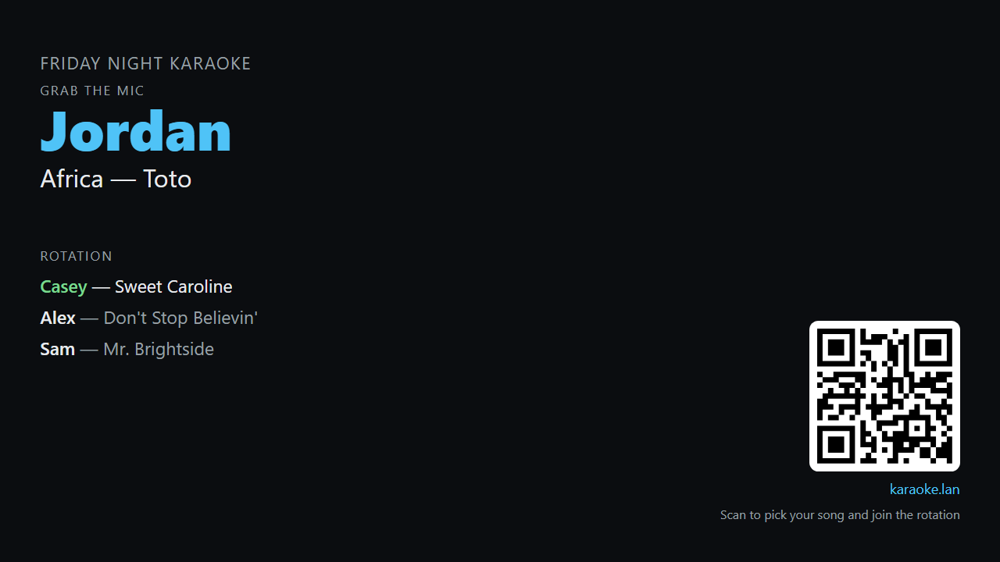
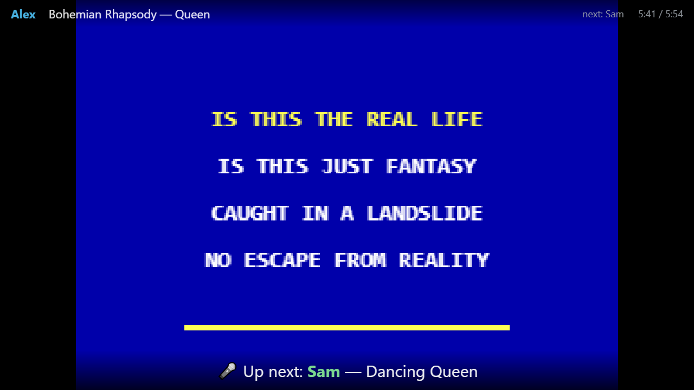
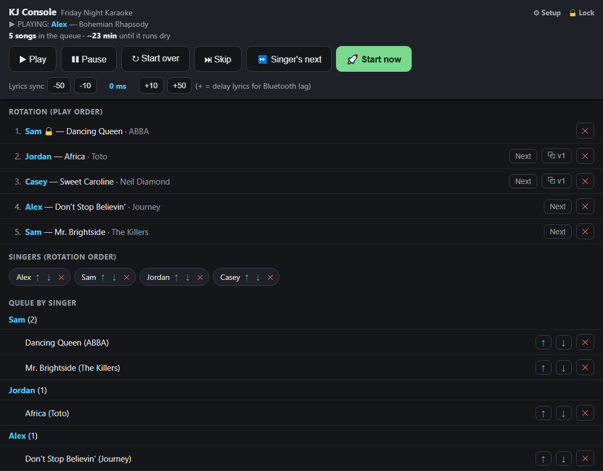
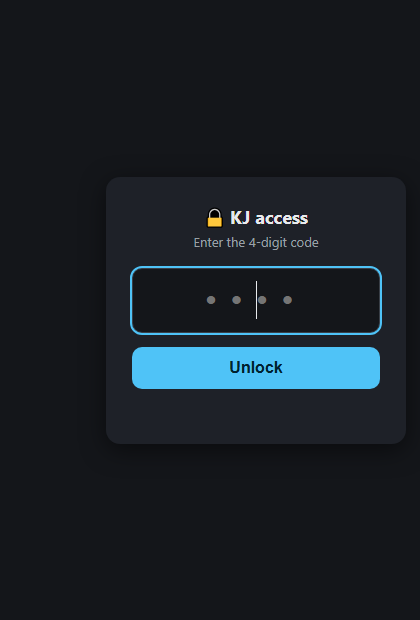
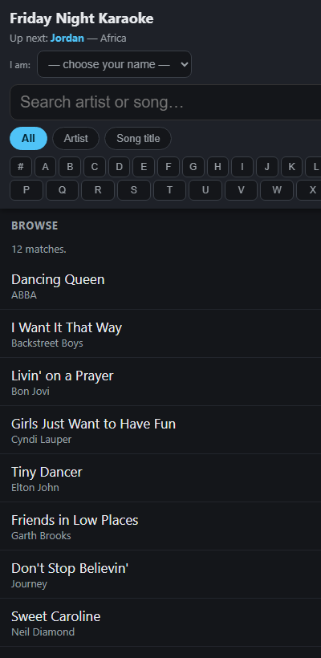
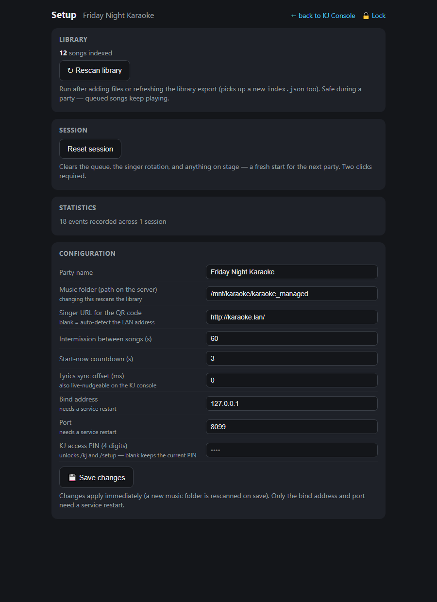

# KriticalDJ

A lean, offline, LAN-only karaoke player. One Python file, zero dependencies.
Point it at a folder of karaoke tracks (`.mp3`+`.cdg` pairs or `.zip`s) and it
runs your whole night: guests browse and queue songs from their own phones,
a fair singer rotation decides who's up, and the TV shows lyrics during songs
and the rotation board (with a join-in QR code) between them.

Built to pair with [song-sorter](https://github.com/Spikelite/song-sorter)'s
cleaned library output, but any folder tree of CDG karaoke files works.

## Quick start

```text
python kriticaldj.py            # first run writes config.json
# edit config.json: set music_root
python kriticaldj.py
```

Then open, in a browser:

| URL | Who | What |
|---|---|---|
| `/` | Singers (BYOD phones/tablets) | Search the library (all / artist / song title, A–Z browse), pick your name, queue songs, save reusable lists |
| `/kiosk` | A shared walk-up device | The same songbook without a personal identity: pick a singer, pick a song, and the picker resets for the next person |
| `/kj` | The KJ (host machine) | Play / Pause / Skip, Start-now, lyrics-sync nudge, queue and rotation management, join QR |
| `/kj/lists` | The KJ | Moderate singers' saved lists and pick the pool the "KJ pick" button draws from |
| `/screen` | The TV/projector (fullscreen browser) | Lyrics during songs; NOW / NEXT / rotation + QR between songs |
| `/setup` | The KJ, before/after the party | Rescan library, reset session, statistics, live config editing |

Singers don't need accounts, because the honor system runs the door at a
karaoke party. The KJ console, list moderation, and setup screen are gated by
a 4-digit PIN (`kj_pin`, default `0000`, changeable from the setup screen).

Deploying on a Raspberry Pi (systemd service, dual-screen Chromium kiosk,
Bluetooth audio calibration): see [DEPLOY.md](DEPLOY.md).

## What it looks like

**The TV.** Between songs, the rotation board: who's up, who's next, and a QR
code guests scan to join. During songs, CDG lyrics with the singer, the
up-next call-out over the last 15 seconds, and a corner track timer.
*(Playback shot below is a mockup. Lyric graphics come from your CDG files.)*

<p>
  
  
</p>

**The KJ console.** Transport (Play / Pause / Start over / Skip / Singer's
next / Start now), live lyrics-sync nudges, the rotation with the locked
up-next slot, per-song version pickers, sticky play-order arrows, an on-demand
join QR, and singer and queue management, all behind the 4-digit PIN.

<p>
  
  
</p>

**Singers' phones and setup.** Guests search, browse, and queue from their own
devices, and the name dropdown stops anyone queueing as someone else by
accident. Setup handles the library, sessions, stats, and all config, live.

<p>
  
  
</p>

## How the rotation works

Classic KJ rules: singers rotate in the order they joined; your own songs play
in the order you queued them; if it's your turn but you have nothing queued,
you're skipped and keep your spot. Songs are always queued under a singer's
name.

The **up-next slot locks** as soon as it is projected, so a late queue add can
never bump the person who was just announced.

### The fair queue

Left alone, a steady stream of new arrivals keeps landing ahead of people who
have been waiting. With `fairness_enabled` on (the default), a newcomer who
hasn't sung yet this session slots in **below the locked top zone** (the first
`lock_percent` of singers, 33% by default), **ahead of** singers who have
already had a turn, and **behind** anyone else still waiting for their first
song. First-timers still get up quickly, and nobody who is nearly at the front
gets pushed back.

A singer who has already performed can only be jumped `bump_limit` times (2 by
default) before they are protected too, so no one is leapfrogged all night.
Both counters reset when that singer takes their turn, and on session reset.
Turning `fairness_enabled` off restores plain join-order rotation.

The KJ can override any of it: nudge any row of the play order up or down (the
change sticks against later queue adds), reorder or remove singers, or hand the
up-next slot to a specific entry.

## Saved lists

Singers can build named lists that persist across parties and load one with a
single tap, queueing every track at once. Each track in a list can pin a
specific **version** of a song, so a list can call for a duet recording without
changing what that song plays by default for everyone else.

The KJ moderates lists at `/kj/lists`: view them grouped by singer, rename or
delete any of them, and star one as the pool that the songbook's **KJ pick**
button draws from. The songbook also has a plain **Random song** button that
picks from the whole library. Both skip songs already queued.

## Pre-song key tone

If your library carries key data, the screen sounds a short tonic triad during
the countdown and shows the song's key, so the singer can pitch their entry.
This needs an `index.json` annotated by song-sorter's Key-detect; without it
the feature stays silent and nothing else changes.

Keys are tracked per audio copy, because alternate recordings of the same song
are often transposed relative to each other, so a copy without its own
confident key stays silent rather than borrowing another's. Machine-estimated
keys must clear `key_tone_min_confidence`, while a hand-curated or ID3-tagged
key is trusted outright. Every check fails silent, on the principle that a
wrong key is worse than no key. Singers can opt out individually from the
songbook.

## Crash safety

Queue, singers, rotation position, and playback phase are journaled to
`state.json` on every change. After a power failure the party resumes at the
intermission board with the interrupted song back at the front of the line.

## Statistics

Every queue, play, skip, and remove is appended to `stats.jsonl`, tied to a
persistent singer identity in `singers.json`. Names are unique
case-insensitively and a returning name reattaches to its id across parties,
while session resets only ever clear the rotation. Writes are crash-safe and
fire-and-forget, so stats can never interrupt the music. `/setup` shows the
running tallies (most played, top singers), and the raw log is plain
JSON-lines for any deeper analysis.

## Config

`config.json` (created on first run), all of it editable live from the
`/setup` page. Only `host` and `port` need a service restart to take effect:

| key | default | meaning |
|---|---|---|
| `music_root` | *(required)* | folder tree of karaoke files |
| `host` / `port` | `0.0.0.0` / `8080` | bind address |
| `party_name` | `Karaoke Night` | shown on all surfaces |
| `intermission_seconds` | `15` | pause between songs (up-next is also shown on screen during a song's last 15 s) |
| `start_now_countdown_seconds` | `3` | countdown after the KJ hits Start now |
| `lyrics_offset_ms` | `0` | shift lyrics to match Bluetooth speaker latency (KJ-adjustable) |
| `public_url` | *(auto-detected)* | URL encoded in the on-screen QR code |
| `kj_pin` | `0000` | 4-digit code gating the operator pages (change it from the setup screen) |
| `fairness_enabled` | `true` | fair queue on/off; off is plain join-order rotation |
| `lock_percent` | `33` | top share of the rotation that newcomers cannot bump |
| `bump_limit` | `2` | times a waiting singer may be jumped before being protected |
| `key_tone_enabled` | `true` | pre-song key reference tone (master switch; singers can opt out) |
| `key_tone_min_confidence` | `50` | percent floor for machine-estimated keys; curated keys always play |

## Files the server writes

`state.json` holds the current party and is the only one a session reset
clears. The rest outlive the party. See [DEPLOY.md](DEPLOY.md) for the full
list and which are safe to delete.

## Status

In active use, with development driven by feedback from real parties. See
[PLAN.md](PLAN.md) for the full phase history and the reasoning behind each
mechanism.

Run the tests: `python test_core.py` (stdlib only, no pytest needed).

## Credits

By **Spike Graham**, with **Claude** (Anthropic) as co-author.

## License

MIT, see [LICENSE](LICENSE).
